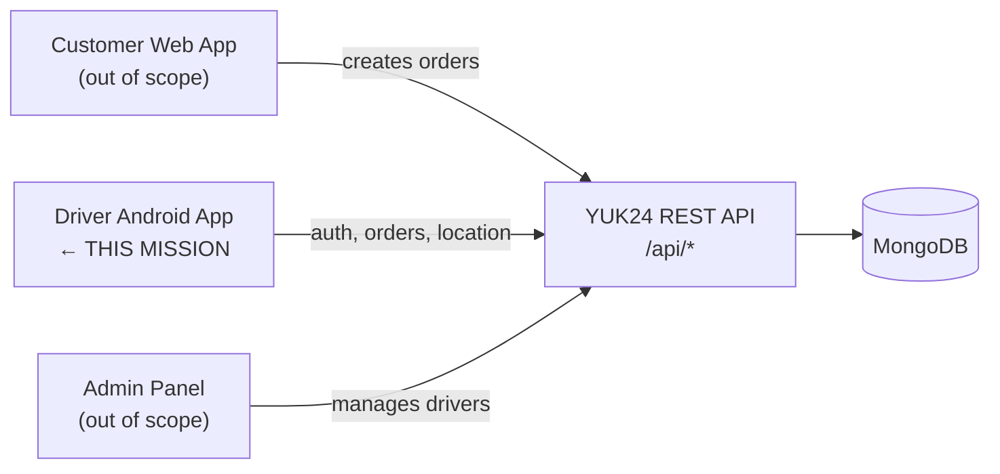
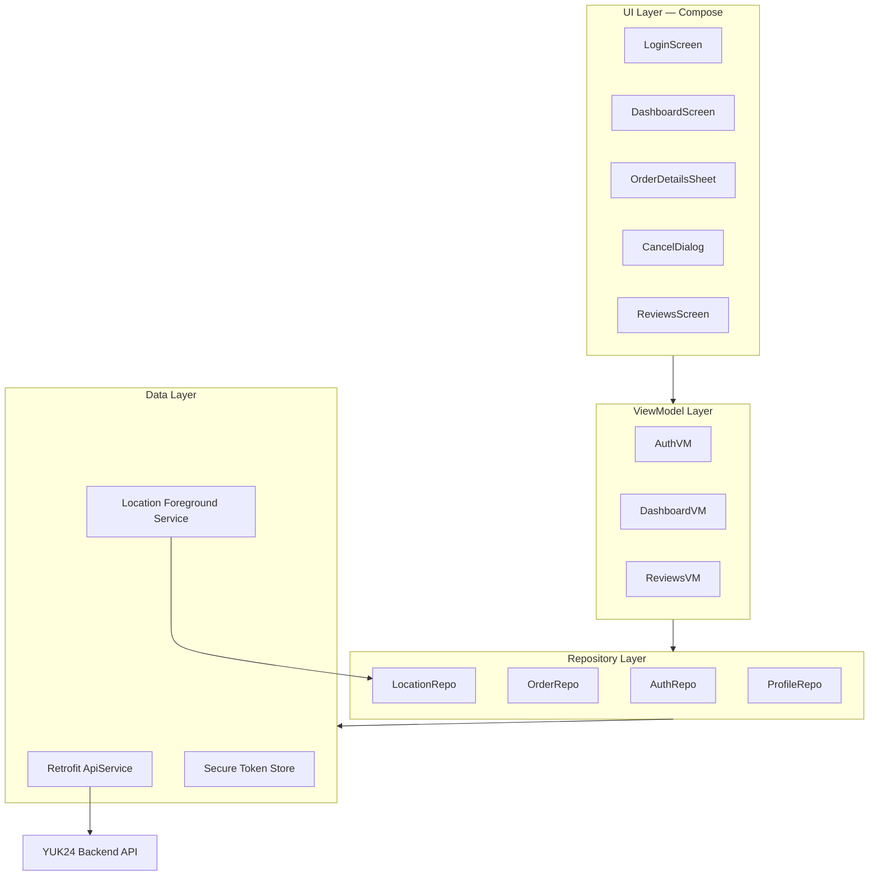
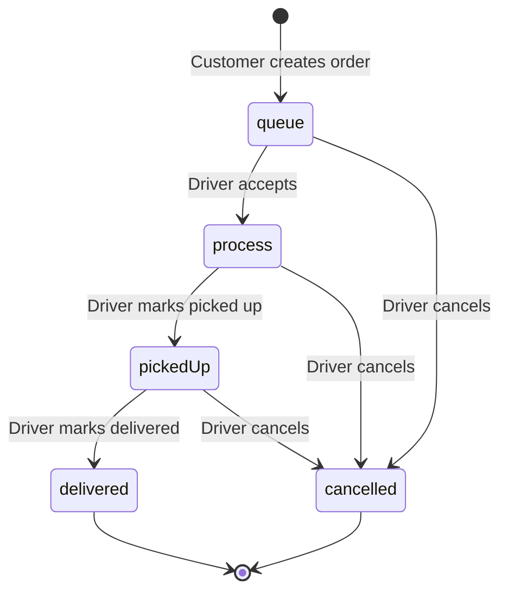

# YUK24 — Technical Mission: Driver Interface (Android + Backend)

> **Scope:** This document is the single technical mission for building the **YUK24 driver interface**. It defines what must be delivered, how the platform works, and how the Android app connects to the backend.  
> **Out of scope:** Customer booking app, admin panel, local/mock/demo modes, and offline-first workflows.

---

## Table of Contents

1. [Mission Statement](#1-mission-statement)
2. [Platform Context](#2-platform-context)
3. [Deliverables](#3-deliverables)
4. [Backend Reference](#4-backend-reference)
5. [Technology Stack](#5-technology-stack)
6. [System Architecture](#6-system-architecture)
7. [Authentication Requirements](#7-authentication-requirements)
8. [Driver App — Functional Requirements](#8-driver-app--functional-requirements)
9. [Order Lifecycle & State Machine](#9-order-lifecycle--state-machine)
10. [Map & Geolocation Requirements](#10-map--geolocation-requirements)
11. [API Contract (Driver Endpoints)](#11-api-contract-driver-endpoints)
12. [Data Models](#12-data-models)
13. [UI/UX Requirements](#13-uiux-requirements)
14. [Internationalization](#14-internationalization)
15. [Error Handling & Edge Cases](#15-error-handling--edge-cases)
16. [Security Requirements](#16-security-requirements)
17. [Non-Functional Requirements](#17-non-functional-requirements)
18. [Implementation Phases](#18-implementation-phases)
19. [Acceptance Criteria](#19-acceptance-criteria)
20. [Reference Material](#20-reference-material)

---

## 1. Mission Statement

**Goal: create the driver interface only.**

Build a native **Android driver application in Kotlin** that allows transport drivers to:

- Authenticate with backend-issued credentials
- View their live GPS position on a map
- Receive available orders from the server
- Accept and fulfill orders through the full delivery lifecycle
- Cancel orders with a mandatory written explanation
- Report GPS location to the backend while online
- View their profile, delivery statistics, and customer reviews

The app must communicate exclusively with the **YUK24 production REST API**. There is no mock mode, no localStorage fallback, and no demo data layer. All auth, orders, status updates, and location reporting go through the backend.

The existing **web driver interface** (`/driver` in `yuk24-frontend`) serves as the **functional and UX reference** for screens, flows, and business rules — not as the target platform.

---

## 2. Platform Context

YUK24 is an on-demand load-assistance platform operating in Uzbekistan (UZS pricing, Tashkent-centric geography).



### Role boundaries

| Role | Interface | In scope? |
|------|-----------|-----------|
| Customer | Web app at `/` | No — only creates orders that appear in driver queue |
| **Driver** | **Android app** | **Yes — primary deliverable** |
| Admin | Web panel at `/admin` | No — admin creates driver accounts; driver app only consumes login |

### How orders reach the driver

1. A customer creates an order via `POST /api/orders` → status `queue`
2. The order appears in `GET /api/driver/orders/available`
3. A driver accepts it → status `process`, `driverId` assigned
4. Driver updates status through workflow endpoints until `delivered` or `cancelled`
5. Customer sees status changes by polling their order (no WebSocket in MVP)

---

## 3. Deliverables

### 3.1 Android driver application (Kotlin)

| Item | Description |
|------|-------------|
| Login screen | Username + password; handle inactive account (403) |
| Main dashboard | Full-screen map, status bar, action buttons |
| Order details | Bottom sheet / dialog with customer info and call action |
| Cancel flow | Modal with 150+ character minimum explanation |
| Reviews screen | List of reviews + average rating |
| Location service | Background-capable GPS reporting to backend |
| Session management | JWT storage, auto-logout on expiry |

### 3.2 Backend integration layer

| Item | Description |
|------|-------------|
| API client | Retrofit/OkHttp with Bearer token interceptor |
| Auth repository | Login, token persistence, logout |
| Order repository | Available orders, accept, status transitions, cancel |
| Location repository | Throttled `PATCH /api/driver/location` |
| Profile repository | `GET /api/driver/me` for stats and reviews |

### 3.3 Documentation

| Item | Description |
|------|-------------|
| README | Setup, build, API base URL configuration |
| Architecture notes | Package structure, data flow |

**Backend implementation is already deployed.** This mission does not require building a new backend from scratch. Extend or fix the existing API only if a driver endpoint is missing or incorrect — see [Section 4](#4-backend-reference).

---

## 4. Backend Reference

### Production API base URL

```
https://yuk24-backend.onrender.com
```

All endpoints are prefixed with `/api`.

**Example:** Driver login → `POST https://yuk24-backend.onrender.com/api/auth/driver/login`

### Backend documentation

Full backend specification (data models, all endpoints, auth, pricing, error codes):

- **File:** [`backendDocs.md`](../backendDocs.md) (in this repository)

The backend is a **Node.js + Express + MongoDB** REST API that already implements:

- Driver JWT authentication
- Order queue and full driver workflow
- Driver geolocation tracking (`PATCH /api/driver/location`)
- Driver profile and statistics (`GET /api/driver/me`)
- Server-side pricing and optional OpenRouteService routing

### Backend technology (reference only)

| Layer | Technology |
|-------|------------|
| Runtime | Node.js ≥ 18 |
| Framework | Express.js |
| Database | MongoDB (Mongoose) |
| Auth | JWT + bcrypt |

Driver accounts are created by admins via `POST /api/admin/drivers`. The Android app does not register drivers.

### Health check

Before starting a session, the app may verify connectivity:

```
GET /api/health
```

**Response 200:** `{ "ok": true, "db": "connected", "timestamp": "..." }`  
**Response 503:** Database disconnected — show offline/unavailable state.

### Route calculation (optional, for map polyline)

The backend exposes public routing used by the web driver app:

```
POST /api/route
Body: { "start": [lat, lng], "end": [lat, lng] }
Response: { "distanceKm", "durationMin", "geometry" }
```

Coordinates are **`[latitude, longitude]`**. Use this for route distance/duration display and map polylines. No direct OpenRouteService calls from the Android app are required if the backend route endpoint is used.

---

## 5. Technology Stack

### Android application

| Layer | Recommended technology |
|-------|------------------------|
| Language | **Kotlin** |
| UI | **Jetpack Compose** (Material 3) |
| Architecture | **MVVM** + Repository pattern |
| Navigation | Jetpack Navigation Compose |
| HTTP | **Retrofit 2** + **OkHttp 4** + kotlinx.serialization or Gson |
| Async | **Kotlin Coroutines** + **Flow** |
| DI | Hilt (recommended) or Koin |
| Maps | **Google Maps SDK for Android** or MapLibre |
| Location | **FusedLocationProviderClient** (Google Play Services) |
| Secure storage | **EncryptedSharedPreferences** or DataStore + encryption for JWT |
| Background location | Foreground Service with `location` type (Android 10+) |

### Backend (existing — do not rebuild)

| Layer | Technology |
|-------|------------|
| API | Express REST at `https://yuk24-backend.onrender.com/api` |
| Auth | JWT Bearer tokens, `role: driver` |
| Docs | [`backendDocs.md`](../backendDocs.md) |

---

## 6. System Architecture

### Android app layers



### Request flow (authenticated)

1. Interceptor reads JWT from secure storage
2. Adds `Authorization: Bearer <token>` to every `/api/driver/*` request
3. On **401**, clear token and navigate to login
4. On **403**, show appropriate error (inactive account or wrong driver for order)

### Polling strategy (MVP — no WebSocket)

| Data | Interval | Condition |
|------|----------|-----------|
| Available orders | 10 seconds | Driver logged in, no active order |
| Driver profile/reviews | 30 seconds | On reviews screen or dashboard header |
| Active order status | Not needed | Driver is source of truth for own actions |

Future enhancement: push notifications / WebSocket for instant order alerts (out of MVP scope).

---

## 7. Authentication Requirements

### Login

```
POST /api/auth/driver/login
Content-Type: application/json

{ "username": "driver1", "password": "secret12" }
```

**Success 200:**

```json
{
  "token": "eyJhbGciOiJIUzI1NiIsInR5cCI6IkpXVCJ9...",
  "user": {
    "id": "665a1b2c3d4e5f6789012345",
    "username": "driver1",
    "name": "Bob",
    "active": true,
    "role": "driver"
  }
}
```

**Failure responses:**

| Code | Meaning | App behavior |
|------|---------|--------------|
| 401 | Invalid credentials | Show "Invalid username or password" |
| 403 | Account inactive | Show "Account deactivated — contact admin" |
| 429 | Rate limited | Show retry message (auth limited to 20 req/15 min/IP) |

### JWT usage

- Store token securely (EncryptedSharedPreferences or equivalent)
- Attach to all `/api/driver/*` requests
- Token expiry follows backend `JWT_EXPIRY` (default 7 days)
- On 401 from any driver endpoint: clear session, return to login
- Logout: delete local token only (no server logout endpoint in MVP)

### JWT payload (reference)

```json
{
  "id": "<MongoDB ObjectId>",
  "role": "driver",
  "iat": 1717500000,
  "exp": 1718104800
}
```

---

## 8. Driver App — Functional Requirements

### 8.1 Login screen

- Username and password fields
- Password visibility toggle
- Loading state on submit
- Error messages for invalid credentials and inactive accounts
- Block access to dashboard until authenticated

**Reference:** Web `DriverLoginPage.jsx` — same fields and error cases.

### 8.2 Main dashboard (map-centric)

The primary screen after login. Layout:

```
┌──────────────────────────────────────┐
│ App bar: logo, reviews, logout       │
├──────────────────────────────────────┤
│ Status banner (when order active)    │  ← color-coded
├──────────────────────────────────────┤
│                                      │
│           Full-screen map            │
│   • Driver blue dot (live GPS)       │
│   • Green marker = pickup            │
│   • Red marker = delivery            │
│   • Route polyline                   │
│                                      │
│   [Waiting overlay when idle]        │
│   [Bottom action bar]                │
└──────────────────────────────────────┘
```

**Idle state:** Driver has no active order. Poll `GET /api/driver/orders/available`. Show waiting indicator until an order is selected or assigned.

**Active order state:** Driver is working an order. Show status banner and context-specific action button.

### 8.3 Order queue behavior

When the driver has no active order:

1. Poll `GET /api/driver/orders/available` every 10 seconds
2. When orders exist, present them to the driver
3. **MVP (match web reference):** Auto-select the first (oldest) available order and show it on the map with status `new`
4. **Recommended enhancement:** Show a list so the driver can choose which order to accept

Each available order includes pickup/delivery coordinates for map markers.

### 8.4 Order action bar

Context-sensitive primary action at the bottom of the map:

| Local status | Button label | API call |
|--------------|--------------|----------|
| `new` | Accept Order | `POST .../accept` |
| `accepted` | Picked Up | `POST .../picked-up` |
| `pickedUp` | Finish Order | `POST .../delivered` |

Additional buttons on all active states:

- **Details** — open order details sheet
- **Cancel** — open cancel dialog (150+ char reason required)

**Reference:** Web `OrderActionBar.jsx`.

### 8.5 Order details

Display:

- Order ID (`orderId`, e.g. `ORD-1024`)
- Pickup address label
- Delivery address label
- Distance (km) and estimated duration (min) from route calculation
- Customer name
- Customer phone with **Call** action (`Intent.ACTION_DIAL`)
- Notes (if present)
- Price (UZS)

**Reference:** Web `OrderModal.jsx`.

### 8.6 Cancel order

- Text field for cancellation reason
- **Minimum 150 characters** required before confirm is enabled
- Character counter showing remaining characters
- On confirm: `POST /api/driver/orders/:id/cancel` with `{ "reason": "..." }`
- Clear active order and return to idle/waiting state

**Reference:** Web `CancelOrderModal.jsx`.

### 8.7 Reviews

- Accessible from app bar (star icon + badge count)
- Fetch from `GET /api/driver/me` (reviews array in response)
- Show average rating in header
- List: star rating, comment, customer name, date, order ID

**Reference:** Web `DriverReviewsModal.jsx`.

### 8.8 Location reporting

While the driver is logged in and the app is in foreground (minimum) or via foreground service (recommended):

```
PATCH /api/driver/location
Authorization: Bearer <token>
Body: { "lat": 41.2995, "lng": 69.2401 }
```

- Throttle updates: every **15–30 seconds** or when moved **> 50 meters**
- Use high-accuracy GPS
- Handle permission denial gracefully (show prompt, limit functionality)
- Android 10+: request `ACCESS_FINE_LOCATION`; for background, `ACCESS_BACKGROUND_LOCATION` + foreground service notification

**This is required** — the web reference app defines this endpoint but does not yet call it. The Android app must implement it.

### 8.9 Session persistence

On app restart while token is valid:

1. Restore JWT from secure storage
2. Skip login screen
3. Call `GET /api/driver/me` to restore profile
4. Check for in-progress order (see gap note below)

**Gap in current backend:** There is no dedicated `GET /api/driver/orders/active` endpoint. For MVP, poll available orders and check if any order has `driverId` matching the logged-in driver with status `process` or `pickedUp`. If the backend adds an active-order endpoint, use it.

---

## 9. Order Lifecycle & State Machine

### Backend statuses (source of truth)



| Backend status | Meaning |
|----------------|---------|
| `queue` | Waiting for a driver |
| `process` | Driver accepted; en route to pickup |
| `pickedUp` | Cargo loaded; en route to delivery |
| `delivered` | Complete |
| `cancelled` | Cancelled with optional reason |

### Android local UI states (map to backend)

The app uses local UI states for action button logic, mapped to backend statuses:

| Local UI state | Backend status | Status banner color | Banner text (EN) |
|----------------|----------------|---------------------|------------------|
| `idle` | — | — | Waiting for orders |
| `new` | `queue` (shown before accept) | Red | New order |
| `accepted` | `process` | Amber | Go to pickup |
| `pickedUp` | `pickedUp` | Green | Go to delivery |

After accept/picked-up/delivered API success, update local state from the API response.

### Driver action rules (enforced by backend)

| Action | Endpoint | Required backend status |
|--------|----------|-------------------------|
| Accept | `POST .../accept` | `queue` |
| Picked up | `POST .../picked-up` | `process` (must be assigned driver) |
| Delivered | `POST .../delivered` | `pickedUp` (must be assigned driver) |
| Cancel | `POST .../cancel` | Not `delivered` or `cancelled` (must be assigned driver) |

### Route recalculation per UI state

| UI state | Route from → to |
|----------|-----------------|
| `new` | Pickup → Delivery |
| `accepted` | Driver GPS → Pickup |
| `pickedUp` | Pickup → Delivery |

Use `POST /api/route` with appropriate start/end coordinates.

---

## 10. Map & Geolocation Requirements

### Map features

- Full-screen map on dashboard
- Driver position: blue dot with optional accuracy circle
- Pickup marker: green
- Delivery marker: red
- Route polyline between relevant points
- Auto-fit camera bounds to include driver + pickup + delivery
- Default center: Tashkent `[41.2995, 69.2401]` when GPS unavailable

### Permissions

| Permission | Purpose |
|------------|---------|
| `ACCESS_FINE_LOCATION` | Live driver position |
| `ACCESS_COARSE_LOCATION` | Fallback |
| `FOREGROUND_SERVICE` + `FOREGROUND_SERVICE_LOCATION` | Continuous location while on duty |
| `POST_NOTIFICATIONS` (Android 13+) | Foreground service notification |

### Location acquisition

- Initial fix on dashboard load with loading overlay
- Continuous updates via `FusedLocationProviderClient.requestLocationUpdates`
- `Priority.PRIORITY_HIGH_ACCURACY`
- Report to backend per [Section 8.8](#88-location-reporting)

**Reference:** Web `DriverMap.jsx` — same marker semantics and route colors (red polyline when order is new, green otherwise).

---

## 11. API Contract (Driver Endpoints)

**Base URL:** `https://yuk24-backend.onrender.com/api`  
**Auth header:** `Authorization: Bearer <driver_jwt>`

All driver endpoints require authentication. URL parameter `:id` is the MongoDB `_id` (24-character hex string), not the display `orderId`.

### Endpoints summary

| Method | Path | Purpose |
|--------|------|---------|
| `POST` | `/auth/driver/login` | Authenticate; receive JWT |
| `GET` | `/driver/orders/available` | List orders with status `queue`, oldest first |
| `POST` | `/driver/orders/:id/accept` | Accept order; status → `process` |
| `POST` | `/driver/orders/:id/picked-up` | Status → `pickedUp` |
| `POST` | `/driver/orders/:id/delivered` | Status → `delivered` |
| `POST` | `/driver/orders/:id/cancel` | Cancel; body `{ "reason": "..." }` |
| `GET` | `/driver/me` | Profile, stats, reviews |
| `PATCH` | `/driver/location` | Update GPS; body `{ "lat", "lng" }` |

### `GET /api/driver/orders/available`

Returns array of order objects with status `queue`. Each order includes:

```json
{
  "_id": "665a1b2c3d4e5f6789012345",
  "orderId": "ORD-1024",
  "customerPhone": "+998901234567",
  "customerName": "Ali",
  "pickup": { "label": "Chorsu Bazaar", "coords": [41.326, 69.228] },
  "delivery": { "label": "Tashkent Airport", "coords": [41.258, 69.281] },
  "loadSize": "medium",
  "unloading": true,
  "price": 57500,
  "distanceKm": 5,
  "durationMin": 12,
  "status": "queue"
}
```

### `POST /api/driver/orders/:id/accept`

Assigns the authenticated driver. Returns updated order with `status: "process"` and populated `driverId`.

### `GET /api/driver/me`

```json
{
  "id": "...",
  "username": "driver1",
  "name": "Bob",
  "phone": "+998901112233",
  "vehicleInfo": "Ford Transit van",
  "active": true,
  "stats": {
    "completedOrders": 42,
    "cancelledOrders": 3,
    "avgDeliveryMin": 28
  },
  "reviews": [
    {
      "rating": 5,
      "comment": "Fast delivery",
      "customerName": "Ali",
      "orderId": "ORD-1020",
      "createdAt": "2026-06-01T10:00:00.000Z"
    }
  ]
}
```

### `PATCH /api/driver/location`

**Request:** `{ "lat": 41.2995, "lng": 69.2401 }`  
**Response:** `{ "ok": true, "lastSeenAt": "2026-06-04T12:00:00.000Z" }`

### Public route endpoint (no auth)

```
POST /api/route
{ "start": [41.2995, 69.2401], "end": [41.3111, 69.2797] }
→ { "distanceKm": 4.52, "durationMin": 9, "geometry": ... }
```

Full request/response details, validation rules, and error codes: [`backendDocs.md`](../backendDocs.md) — Sections 9, 10, 11.

---

## 12. Data Models

### Order (driver view)

```kotlin
data class Order(
    val id: String,              // MongoDB _id — use in API URLs
    val orderId: String,         // Display ID e.g. "ORD-1024"
    val customerName: String?,
    val customerPhone: String,
    val notes: String?,
    val pickup: LocationPoint,
    val delivery: LocationPoint,
    val loadSize: String,
    val unloading: Boolean,
    val price: Int,
    val distanceKm: Double,
    val durationMin: Int?,
    val status: OrderStatus,
    val cancelReason: String?
)

data class LocationPoint(
    val label: String,
    val coords: List<Double>     // [latitude, longitude]
)
```

### Order status enum

```kotlin
enum class OrderStatus {
    QUEUE,      // "queue"
    PROCESS,    // "process"
    PICKED_UP,  // "pickedUp"
    DELIVERED,  // "delivered"
    CANCELLED   // "cancelled"
}
```

### Driver profile

```kotlin
data class DriverProfile(
    val id: String,
    val username: String,
    val name: String?,
    val phone: String?,
    val vehicleInfo: String?,
    val active: Boolean,
    val stats: DriverStats,
    val reviews: List<Review>
)

data class DriverStats(
    val completedOrders: Int,
    val cancelledOrders: Int,
    val avgDeliveryMin: Int?
)

data class Review(
    val rating: Int,             // 1–5
    val comment: String?,
    val customerName: String?,
    val orderId: String?,
    val createdAt: String
)
```

### Auth session

```kotlin
data class AuthSession(
    val token: String,
    val userId: String,
    val username: String,
    val name: String?,
    val loginAt: Long            // epoch ms for local session tracking
)
```

---

## 13. UI/UX Requirements

### Design principles

- **Mobile-first** — primary device is Android phone used in the field
- **Map-centric** — map occupies maximum screen space during active duty
- **Large touch targets** — action buttons must be easy to tap while driving (parked)
- **High contrast status banner** — red / amber / green for order phase
- **Minimal steps** — one primary action visible at a time

### Screen list

| Screen | Type | Notes |
|--------|------|-------|
| Login | Full screen | Entry point when no valid token |
| Dashboard | Full screen | Map + overlays; main working screen |
| Order details | Bottom sheet | Slides up over map |
| Cancel order | Dialog | Blocks until confirmed or dismissed |
| Reviews | Full screen or sheet | Scrollable list |

### Status banner colors

| State | Color | Example text |
|-------|-------|--------------|
| New order | `#EF4444` (red) | New order — ORD-1024 |
| Accepted | `#F59E0B` (amber) | Go to pickup — ORD-1024 |
| Picked up | `#22C55E` (green) | Go to delivery — ORD-1024 |

### Action button colors (match web reference)

| Action | Color |
|--------|-------|
| Accept | Green |
| Picked Up | Amber |
| Finish | Primary brand blue |
| Cancel | Red outline/icon |

### Web reference mapping

| Web component | Android equivalent |
|---------------|-------------------|
| `DriverLoginPage.jsx` | `LoginScreen` |
| `DriverPage.jsx` | `DashboardScreen` + ViewModel |
| `DriverMap.jsx` | `MapView` composable / Google Map fragment |
| `OrderActionBar.jsx` | Bottom action bar composable |
| `OrderModal.jsx` | Order details bottom sheet |
| `CancelOrderModal.jsx` | Cancel dialog |
| `DriverReviewsModal.jsx` | Reviews screen |

---

## 14. Internationalization

Support **Uzbek (uz)** and **English (en)** — matching the web driver interface.

All user-facing strings must use Android string resources (`strings.xml`, `values-uz/strings.xml`).

Key strings to include (from web `i18n.js`):

| Key | English | Uzbek |
|-----|---------|-------|
| Login title | Driver Login | Haydovchi kirish |
| Accept | Accept Order | Buyurtmani qabul qilish |
| Picked up | Picked Up | Yuk olindi |
| Finish | Finish Order | Buyurtmani yakunlash |
| New order | New order | Yangi buyurtma |
| Go to pickup | Go to pickup | Olish joyiga boring |
| Go to delivery | Go to delivery | Yetkazish joyiga boring |
| Waiting | Waiting for orders... | Buyurtma kutilmoqda... |
| Cancel | Cancel Order | Buyurtmani bekor qilish |
| Cancel min chars | Minimum 150 characters required | Kamida 150 ta belgi kiritilishi kerak |
| Reviews | My Reviews | Menga yozilgan sharhlar |
| Logout | Logout | Chiqish |
| Invalid login | Invalid username or password | Foydalanuvchi nomi yoki parol noto'g'ri |
| Inactive account | Account deactivated | Hisob faol emas |

Default language: **Uzbek**.

---

## 15. Error Handling & Edge Cases

### HTTP error handling

| Code | Scenario | User-facing action |
|------|----------|-------------------|
| 400 | Invalid status transition | Show error toast; refresh order state |
| 401 | Expired/invalid JWT | Clear session → login screen |
| 403 | Inactive driver or wrong driver for order | Show specific message |
| 404 | Order not found | Clear active order; refresh queue |
| 429 | Rate limit | Show "Too many requests, try again" |
| 5xx / network | Server unreachable | Show offline banner; retry with backoff |

### Edge cases

| Scenario | Expected behavior |
|----------|-------------------|
| GPS permission denied | Show rationale; allow login but warn map/location limited |
| No available orders | Show waiting overlay on map |
| Order accepted by another driver | Accept returns 400/404 — refresh queue, show message |
| App killed during active order | On restart, attempt to restore in-progress order |
| Token expires mid-shift | 401 on next API call → login screen |
| Backend cold start (Render free tier) | Show loading; retry health check |

---

## 16. Security Requirements

| Requirement | Implementation |
|-------------|----------------|
| JWT storage | EncryptedSharedPreferences or Android Keystore |
| No credentials in logs | Strip tokens from OkHttp logging in release builds |
| HTTPS only | Base URL must use `https://` |
| Certificate pinning | Optional for production hardening |
| ProGuard/R8 | Obfuscate release builds |
| Location privacy | Request minimum permissions; stop reporting on logout |

---

## 17. Non-Functional Requirements

| Requirement | Target |
|-------------|--------|
| Min Android version | API 26 (Android 8.0) or API 28+ recommended |
| Orientation | Portrait primary; landscape optional |
| Offline | Show clear offline state; queue actions not supported offline |
| Performance | Map renders at 60fps; location updates do not block UI |
| Battery | Throttle location API calls; use balanced update intervals |
| APK size | Reasonable for field deployment (< 30 MB target) |

---

## 18. Implementation Phases

### Phase 1 — Foundation

- [ ] Project setup (Kotlin, Compose, Hilt, Retrofit)
- [ ] API client with auth interceptor
- [ ] Secure token storage
- [ ] Login screen + session restore
- [ ] Health check / connectivity indicator

### Phase 2 — Core dashboard

- [ ] Google Maps integration
- [ ] GPS acquisition and live marker
- [ ] Poll available orders
- [ ] Display order on map (pickup/delivery markers)
- [ ] Route polyline via `POST /api/route`
- [ ] Status banner + waiting state

### Phase 3 — Order workflow

- [ ] Accept order
- [ ] Picked up transition
- [ ] Delivered transition
- [ ] Cancel with 150-char validation
- [ ] Order details bottom sheet with call action
- [ ] Route recalculation per status

### Phase 4 — Location & profile

- [ ] Foreground location service
- [ ] `PATCH /api/driver/location` throttled reporting
- [ ] Reviews screen from `GET /api/driver/me`
- [ ] Stats display (completed orders, avg delivery time)

### Phase 5 — Polish

- [ ] Uzbek + English strings
- [ ] Error toasts and offline handling
- [ ] Active order restore on app restart
- [ ] Order selection list (enhancement over web auto-pick)
- [ ] Release build + signing

---

## 19. Acceptance Criteria

The driver interface is complete when a driver can:

1. **Log in** with backend credentials created by admin
2. **See live GPS** on a full-screen map
3. **Receive available orders** from the server (polling)
4. **Accept an order** — status becomes `process`, route shows driver → pickup
5. **Mark picked up** — status becomes `pickedUp`, route shows pickup → delivery
6. **Finish delivery** — status becomes `delivered`, return to waiting state
7. **Cancel an order** with 150+ character reason — status becomes `cancelled`
8. **View order details** including customer phone with working call intent
9. **Report location** to backend while logged in
10. **View reviews** and average rating from `GET /api/driver/me`
11. **Handle errors** — inactive account, expired token, network failure
12. **Run in Uzbek and English**

All flows must work against **`https://yuk24-backend.onrender.com`** with no mock or local data layer.

---

## 20. Reference Material

| Document | Location | Purpose |
|----------|----------|---------|
| Backend API specification | [`backendDocs.md`](../backendDocs.md) | Full REST API, models, auth, errors |
| Web driver interface docs | [`DRIVER_INTERFACE.md`](./DRIVER_INTERFACE.md) | UX/flow reference from existing web app |
| Web driver source | `src/pages/DriverPage.jsx` | Reference implementation |
| Web driver components | `src/components/driver/` | UI behavior reference |
| Web driver API client | `src/services/backendApi.js` | Endpoint paths and normalizers |
| Original demo spec | `technical_mission.txt` | Product background (customer flow) |

### Production endpoints quick reference

| Service | URL |
|---------|-----|
| API base | `https://yuk24-backend.onrender.com` |
| Health | `GET /api/health` |
| Driver login | `POST /api/auth/driver/login` |
| Available orders | `GET /api/driver/orders/available` |
| Driver profile | `GET /api/driver/me` |
| Location update | `PATCH /api/driver/location` |
| Route calculation | `POST /api/route` |

### Intentionally out of scope

- Customer booking Android app
- Admin Android app
- Local/mock/demo mode or offline order simulation
- Payment integration
- WebSocket / push notifications (future phase)
- Building a new backend from scratch
- OpenRouteService direct integration from Android (use backend `/api/route`)

---

*YUK24 Driver Technical Mission — Android (Kotlin) + Production Backend Integration*
