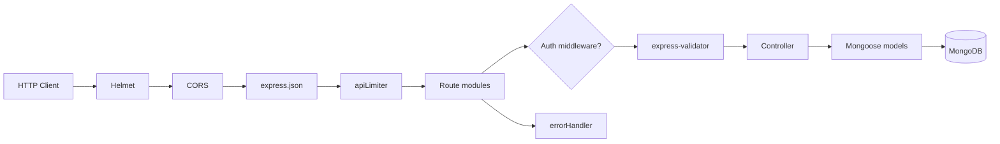
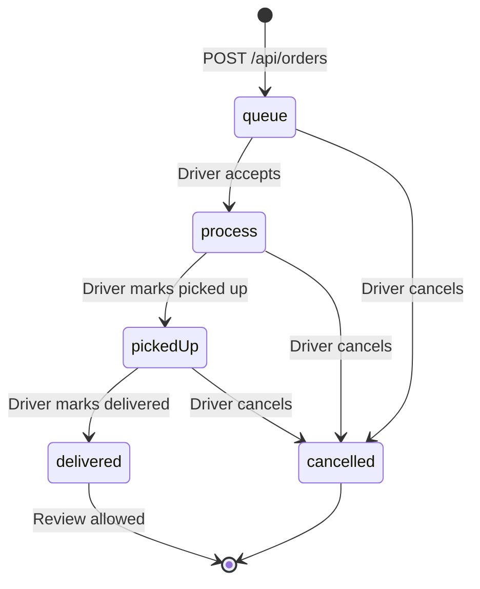
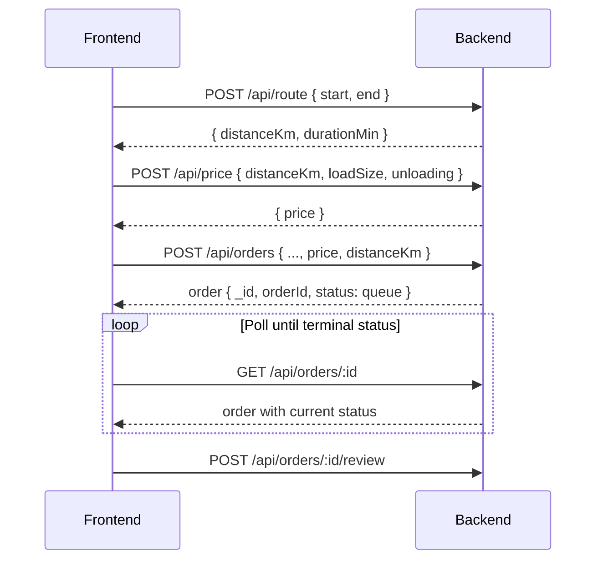

# YUK 24 Backend — Technical Documentation

Complete reference for the **YUK 24** on-demand cargo delivery REST API. This backend serves the customer booking flow, driver workflow, and admin dashboard for the React/Vite frontend.

---

## Table of contents

1. [Overview](#1-overview)
2. [Technology stack](#2-technology-stack)
3. [Architecture](#3-architecture)
4. [Project structure](#4-project-structure)
5. [Installation and configuration](#5-installation-and-configuration)
6. [Data models](#6-data-models)
7. [Authentication and authorization](#7-authentication-and-authorization)
8. [Pricing engine](#8-pricing-engine)
9. [Order lifecycle](#9-order-lifecycle)
10. [API reference](#10-api-reference)
11. [Error handling](#11-error-handling)
12. [Security](#12-security)
13. [Frontend integration](#13-frontend-integration)
14. [Operations and deployment](#14-operations-and-deployment)
15. [Roadmap and limitations](#15-roadmap-and-limitations)

---

## 1. Overview

**YUK 24** is an on-demand cargo delivery platform. This backend:

- Stores orders, drivers, admins, and reviews in **MongoDB**
- Exposes a **REST API** under the `/api` prefix
- Authenticates admins and drivers with **JWT**
- Supports **guest customers** who book by phone number (no customer login in MVP)
- Enforces **server-side pricing** so clients cannot submit arbitrary prices
- Optionally uses **OpenRouteService (ORS)** for routing, with a Haversine fallback

### Roles

| Role | Authentication | Primary responsibilities |
|------|----------------|--------------------------|
| **Customer** | None (phone-based access) | Create orders, view orders by phone, submit reviews |
| **Driver** | JWT (`role: driver`) | View queue, accept orders, update status, share location |
| **Admin** | JWT (`role: admin`) | Dashboard stats, manage orders and drivers, view charts |

### Base URL

- **Development:** `http://localhost:5000` (or the value of `PORT` in `.env`)
- **All API routes** are prefixed with `/api`

---

## 2. Technology stack

| Layer | Technology | Version |
|-------|------------|---------|
| Runtime | Node.js | ≥ 18 LTS |
| Framework | Express.js | ^4.21 |
| Database | MongoDB | — |
| ODM | Mongoose | ^8.8 |
| Authentication | jsonwebtoken + bcryptjs | ^9.0 / ^2.4 |
| Validation | express-validator | ^7.2 |
| Security | helmet, cors, express-rate-limit | ^7.1 / ^2.8 / ^7.4 |
| Configuration | dotenv | ^16.4 |

### npm scripts

| Command | Description |
|---------|-------------|
| `npm run dev` | Start server with `node --watch` (auto-restart on file changes) |
| `npm start` | Production start via `node src/server.js` |

---

## 3. Architecture

### Request flow



### Application bootstrap

1. **`src/server.js`** — Connects to MongoDB, then starts listening on `config.port`.
2. **`src/app.js`** — Assembles Express: global middleware, route mounts, 404 handler, error handler.
3. **`src/config/db.js`** — Calls `mongoose.connect()`; exits the process on connection failure.
4. **`src/config/index.js`** — Loads `.env` and exports port, MongoDB URI, JWT settings, admin defaults, CORS origin, ORS API key.

### Route mounting

| Mount path | Module | Purpose |
|------------|--------|---------|
| `/api/auth` | `authRoutes.js` | Admin and driver login |
| `/api` | `publicRoutes.js` | Health check, route calculation, pricing |
| `/api` | `orderRoutes.js` | Customer order endpoints |
| `/api/driver` | `driverRoutes.js` | Driver operations (all routes protected) |
| `/api/admin` | `adminRoutes.js` | Admin operations (all routes protected) |

**Routing note:** `GET /api/orders/by-phone` is registered before `GET /api/orders/:id` so `by-phone` is not treated as an order ID.

### Layer responsibilities

| Layer | Responsibility |
|-------|----------------|
| **Routes** | HTTP method, path, middleware chain |
| **Validators** | Input rules via `express-validator`; failures return HTTP 400 with `details` |
| **Controllers** | Business logic, HTTP status codes, JSON responses |
| **Models** | Mongoose schemas, indexes, password comparison helpers |
| **Middleware** | JWT guards, rate limiting, centralized error handling |
| **utils/pricing.js** | Single source of truth for UZS price calculation |

---

## 4. Project structure

```
yuk24-backend/
├── .env.example                  # Environment variable template
├── package.json
├── README.md                     # Quick start guide
├── DOCUMENTATION.md              # This document
├── BACKEND_API_FOR_FRONTEND.txt  # Frontend integration summary
├── backend_technical_mission.txt   # Original product specification
└── src/
    ├── server.js                 # Entry point: DB connect + HTTP listen
    ├── app.js                    # Express application assembly
    ├── config/
    │   ├── index.js              # Environment configuration
    │   └── db.js                 # MongoDB connection
    ├── models/
    │   ├── Order.js
    │   ├── Driver.js
    │   ├── Admin.js
    │   ├── User.js               # Prepared for future customer accounts
    │   ├── Review.js
    │   └── index.js
    ├── controllers/
    │   ├── authController.js
    │   ├── orderController.js
    │   ├── driverController.js
    │   ├── adminController.js
    │   ├── publicController.js
    │   └── healthController.js
    ├── routes/
    │   ├── authRoutes.js
    │   ├── publicRoutes.js
    │   ├── orderRoutes.js
    │   ├── driverRoutes.js
    │   └── adminRoutes.js
    ├── middleware/
    │   ├── auth.js
    │   ├── validate.js
    │   ├── rateLimit.js
    │   └── errorHandler.js
    ├── validators/
    │   ├── authValidator.js
    │   ├── orderValidator.js
    │   └── adminValidator.js
    └── utils/
        └── pricing.js
```

---

## 5. Installation and configuration

### Prerequisites

- Node.js 18 or later
- MongoDB (local or MongoDB Atlas)
- npm

### Setup

```bash
cd yuk24-backend
npm install
cp .env.example .env
# Edit .env with your values
npm run dev
```

On the first admin login, if no admin document exists in the database, the server creates one using `ADMIN_USERNAME` and `ADMIN_PASSWORD` (password stored as a bcrypt hash).

### Environment variables

| Variable | Required | Default | Description |
|----------|----------|---------|-------------|
| `PORT` | No | `5000` | HTTP listen port |
| `MONGODB_URI` | No | `mongodb://localhost:27017/yuk24` | MongoDB connection string |
| `JWT_SECRET` | **Yes in production** | `dev-secret-change-me` | Secret used to sign JWTs |
| `JWT_EXPIRY` | No | `7d` | Token lifetime (e.g. `7d`, `24h`) |
| `ADMIN_USERNAME` | No | `admin` | Bootstrap admin username |
| `ADMIN_PASSWORD` | No | `admin123` | Bootstrap admin password (hashed on first create) |
| `VITE_APP_URL` | No | `*` | Allowed CORS origin (set to your frontend URL) |
| `ORS_API_KEY` | No | — | OpenRouteService API key for `POST /api/route` |

**Example `.env` for local development with a Vite frontend:**

```env
PORT=5000
MONGODB_URI=mongodb://localhost:27017/yuk24
JWT_SECRET=change-me-in-production
JWT_EXPIRY=7d
ADMIN_USERNAME=admin
ADMIN_PASSWORD=admin123
VITE_APP_URL=http://localhost:5173
# ORS_API_KEY=your-openrouteservice-key
```

---

## 6. Data models

### Order

Each order has a human-readable `orderId` (e.g. `ORD-1001`) auto-generated from the previous order. API URLs use the MongoDB `_id` (24-character hex string).

| Field | Type | Description |
|-------|------|-------------|
| `orderId` | String | Unique human-readable ID |
| `customerPhone` | String | Required |
| `customerName` | String | Optional |
| `pickup` | `{ label, coords: [lat, lng] }` | Pickup location |
| `delivery` | `{ label, coords: [lat, lng] }` | Delivery location |
| `loadSize` | Enum | `xsmall`, `small`, `medium`, `large`, `xlarge` |
| `unloading` | Boolean | Default `false` |
| `price` | Number | Price in UZS; validated against server formula |
| `distanceKm` | Number | Route distance in kilometers |
| `durationMin` | Number | Optional estimated duration |
| `status` | Enum | `queue`, `process`, `pickedUp`, `delivered`, `cancelled` |
| `driverId` | ObjectId → Driver | Assigned on accept |
| `cancelReason` | String | Optional cancellation reason |
| `userId` | ObjectId → User | Optional link to registered user |
| `review` | `{ rating, comment }` | Embedded review after delivery |
| `completedAt` | Date | Set when status becomes `delivered` |
| `deletedAt` | Date | Soft delete marker (`null` = active) |
| `createdAt`, `updatedAt` | Date | Mongoose timestamps |

**Indexes:** `(status, createdAt)`, `(driverId, status)`, `(customerPhone, createdAt)`.

### Driver

| Field | Type | Description |
|-------|------|-------------|
| `username` | String | Unique login name |
| `passwordHash` | String | bcrypt hash; never returned in JSON |
| `active` | Boolean | Inactive drivers cannot log in |
| `name`, `phone`, `vehicleInfo` | String | Optional profile fields |
| `currentLocation` | GeoJSON Point | Stored as `[lng, lat]` in `coordinates` |
| `lastSeenAt` | Date | Updated via `PATCH /api/driver/location` |
| `deletedAt` | Date | Soft delete / deactivation |

**Indexes:** `username`, `(active, lastSeenAt)`.

**Methods:** `comparePassword(plain)` — bcrypt comparison.

### Admin

| Field | Type | Description |
|-------|------|-------------|
| `username` | String | Unique |
| `passwordHash` | String | bcrypt hash |

Created automatically on first admin login if the collection is empty.

### Review (separate collection)

Stored in addition to the embedded `order.review` field to support driver-level review queries. Upserted when a customer submits a review.

| Field | Type |
|-------|------|
| `orderId` | ObjectId (unique) |
| `driverId` | ObjectId |
| `rating` | Integer 1–5 |
| `comment`, `customerName`, `customerPhone` | Optional strings |

**Indexes:** `(driverId, createdAt)`, unique on `orderId`.

### User (future use)

Schema exists for phone-unique customers with `savedAddresses` and `preferredLanguage`. **Not connected to auth or order APIs in the current MVP** — orders may optionally include a `userId`.

---

## 7. Authentication and authorization

### JWT payload

```json
{
  "id": "<MongoDB ObjectId as string>",
  "role": "admin",
  "iat": 1717500000,
  "exp": 1718104800
}
```

Signed with `JWT_SECRET`, expires per `JWT_EXPIRY`.

### Authorization header

```
Authorization: Bearer <token>
```

### Login endpoints

| Endpoint | Request body | Success response |
|----------|--------------|------------------|
| `POST /api/auth/admin/login` | `{ "username", "password" }` | `{ "token", "user": { "id", "username", "role": "admin" } }` |
| `POST /api/auth/driver/login` | `{ "username", "password" }` | `{ "token", "user": { "id", "username", "name", "active", "role": "driver" } }` |

Auth routes use **`authLimiter`**: maximum 20 requests per 15 minutes per IP.

### Middleware

| Middleware | Applied to | Behavior |
|------------|------------|----------|
| `requireAdmin` | All `/api/admin/*` | Validates JWT with `role === 'admin'`, loads admin document, sets `req.admin` |
| `requireDriver` | All `/api/driver/*` | Validates JWT with `role === 'driver'`, checks driver is active and not deleted, sets `req.driver` and `req.driverId` |
| `optionalAuth` | Exported but not mounted | Attaches `req.authPayload` when a valid token is present |

### Customer access model (MVP)

- No JWT required to create orders or list orders by phone.
- Optional ownership check: `GET /api/orders/:id?phone=...` returns **403** if the phone does not match `customerPhone`.
- Anyone who knows a phone number can list that customer's orders. This is an MVP trade-off; OTP-based customer auth is planned for a future phase.

---

## 8. Pricing engine

All prices are in **UZS** (Uzbekistani soum). Implementation lives in `src/utils/pricing.js`.

### Constants

| Constant | Value (UZS) |
|----------|-------------|
| `BASE_PRICE` | 10,000 |
| `PRICE_PER_KM` | 3,000 (charged from km 0; no free distance) |
| `UNLOADING_FEE` | 20,000 (only when `unloading === true`) |

### Load size multipliers

| `loadSize` | Multiplier |
|------------|------------|
| `xsmall` | 1.0 |
| `small` | 1.2 |
| `medium` | 1.5 |
| `large` | 2.0 |
| `xlarge` | 2.5 |

### Formula

```
distanceFee       = distanceKm × PRICE_PER_KM
preMultSubtotal   = BASE_PRICE + distanceFee
price             = round(preMultSubtotal × loadMultiplier + unloadingFee)
```

The multiplier applies to **base price + distance fee** only. The unloading fee is added **after** multiplication.

### Worked example

Given `distanceKm = 5`, `loadSize = "medium"`, `unloading = true`:

```
preMultSubtotal = 10,000 + (5 × 3,000) = 25,000
price           = round(25,000 × 1.5 + 20,000) = 57,500 UZS
```

### Order creation validation

`POST /api/orders` requires a `price` field. The server recomputes the price and rejects the request if the client value differs by more than **1 UZS**. The stored order always uses the server-computed value.

---

## 9. Order lifecycle



### Status definitions

| Status | Meaning |
|--------|---------|
| `queue` | Order created; waiting for a driver |
| `process` | Driver accepted; en route to pickup |
| `pickedUp` | Cargo loaded |
| `delivered` | Delivery complete; `completedAt` is set |
| `cancelled` | Order cancelled; optional `cancelReason` |

### Driver action rules

| Action | Endpoint | Required status | Additional checks |
|--------|----------|-----------------|-------------------|
| Accept | `POST .../accept` | `queue` | — |
| Cancel | `POST .../cancel` | Not `delivered` or `cancelled` | Must be the assigned driver |
| Picked up | `POST .../picked-up` | `process` | Must be the assigned driver |
| Delivered | `POST .../delivered` | `pickedUp` | Must be the assigned driver |

### Reviews

- Allowed only when `status === "delivered"`
- One review per order
- Stored both on the order document and in the `Review` collection
- No authentication required (relies on knowledge of order ID)

### Order ID generation

The server reads the most recent `orderId`, parses the numeric suffix from `ORD-(\d+)`, and increments it. The first order receives `ORD-1001`.

---

## 10. API reference

**General conventions:**

- Request bodies: `Content-Type: application/json`
- URL parameters named `:id` expect a MongoDB ObjectId (24-character hex)
- Display IDs like `ORD-1001` appear in responses but are not used in URL paths

---

### 10.1 Public endpoints

#### `GET /api/health`

Checks API and database connectivity.

**Response 200** (database connected):

```json
{
  "ok": true,
  "db": "connected",
  "timestamp": "2026-06-04T12:00:00.000Z"
}
```

**Response 503** (database disconnected): same shape with `"ok": false`, `"db": "disconnected"`.

---

#### `POST /api/route`

Calculates distance and estimated travel time between two coordinates.

**Request body:**

```json
{
  "start": [41.2995, 69.2401],
  "end": [41.3111, 69.2797]
}
```

Coordinates are **`[latitude, longitude]`**.

**Behavior:**

1. When `ORS_API_KEY` is set, calls the OpenRouteService driving-car API and returns road distance, duration, and optional route geometry.
2. When the key is missing or the ORS call fails, falls back to **Haversine** great-circle distance and estimates duration assuming **30 km/h** average speed.

**Response 200:**

```json
{
  "distanceKm": 4.52,
  "durationMin": 9,
  "geometry": null
}
```

---

#### `POST /api/price`

Returns a server-calculated price quote.

**Request body:**

```json
{
  "distanceKm": 4.52,
  "loadSize": "medium",
  "unloading": false
}
```

**Response 200:**

```json
{ "price": 33580 }
```

---

### 10.2 Authentication

#### `POST /api/auth/admin/login`

**Request:**

```json
{ "username": "admin", "password": "admin123" }
```

**Response 200:**

```json
{
  "token": "eyJhbGciOiJIUzI1NiIsInR5cCI6IkpXVCJ9...",
  "user": { "id": "665a1b2c3d4e5f6789012345", "username": "admin", "role": "admin" }
}
```

**Response 401:** `{ "error": "Invalid credentials" }`

---

#### `POST /api/auth/driver/login`

**Response 200:**

```json
{
  "token": "eyJhbG...",
  "user": {
    "id": "...",
    "username": "driver1",
    "name": "Bob",
    "active": true,
    "role": "driver"
  }
}
```

**Response 401:** Invalid credentials  
**Response 403:** `{ "error": "Account inactive", "message": "Driver account is deactivated" }`

---

### 10.3 Customer orders (no authentication)

#### `POST /api/orders`

Creates a new order with status `queue`.

**Request body:**

```json
{
  "customerPhone": "+998901234567",
  "customerName": "Ali",
  "pickup": { "label": "Chorsu Bazaar", "coords": [41.326, 69.228] },
  "delivery": { "label": "Tashkent Airport", "coords": [41.258, 69.281] },
  "loadSize": "medium",
  "unloading": true,
  "price": 57500,
  "distanceKm": 5,
  "durationMin": 12
}
```

**Response 201:** Full order object including `_id`, `orderId`, and `status: "queue"`.

**Response 400 (validation):**

```json
{
  "error": "Validation failed",
  "details": [{ "field": "customerPhone", "message": "customerPhone required" }]
}
```

**Response 400 (price mismatch):**

```json
{
  "error": "Price mismatch",
  "details": "Client price 50000 differs from server-computed price 57500 by more than 1 UZS"
}
```

---

#### `GET /api/orders/by-phone?phone=<phone>`

Returns all non-deleted orders for the given phone number, newest first. `driverId` is populated with `username` and `name`.

---

#### `GET /api/orders/:id`

Returns a single order. Optional query parameter `?phone=<phone>` enforces ownership.

**Response 200:** Order with `driverId` populated (`username`, `name`, `phone`).  
**Response 403:** Phone does not match order owner.  
**Response 404:** Order not found.

---

#### `POST /api/orders/:id/review`

**Request body:**

```json
{ "rating": 5, "comment": "Fast and careful delivery" }
```

**Response 200:** Updated order with `review` attached.

**Response 400:** Order not delivered, or already reviewed.  
**Response 404:** Order not found.

---

### 10.4 Driver endpoints

All driver endpoints require `Authorization: Bearer <driver_token>`.

| Method | Path | Description |
|--------|------|-------------|
| `GET` | `/api/driver/orders/available` | Orders with status `queue`, oldest first |
| `POST` | `/api/driver/orders/:id/accept` | Assign driver; status → `process` |
| `POST` | `/api/driver/orders/:id/cancel` | Cancel order; optional body `{ "reason": "..." }` |
| `POST` | `/api/driver/orders/:id/picked-up` | Status → `pickedUp` |
| `POST` | `/api/driver/orders/:id/delivered` | Status → `delivered`; optional `{ "completedAt": "<ISO8601>" }` |
| `GET` | `/api/driver/me` | Driver profile and delivery statistics |
| `PATCH` | `/api/driver/location` | Update GPS position; body `{ "lat", "lng" }` |

**`GET /api/driver/me` — stats object:**

```json
{
  "stats": {
    "completedOrders": 42,
    "cancelledOrders": 3,
    "avgDeliveryMin": 28
  }
}
```

`avgDeliveryMin` is the mean of `durationMin` across delivered orders, or `null` if none exist.

**`PATCH /api/driver/location` — response:**

```json
{ "ok": true, "lastSeenAt": "2026-06-04T12:00:00.000Z" }
```

---

### 10.5 Admin endpoints

All admin endpoints require `Authorization: Bearer <admin_token>`.

#### `GET /api/admin/stats`

```json
{
  "totalOrders": 150,
  "completedOrders": 120,
  "revenue": 4500000,
  "activeDrivers": 8,
  "totalDrivers": 10
}
```

Revenue is the sum of `price` for all orders with `status: "delivered"`.

---

#### `GET /api/admin/orders`

**Query parameters:**

| Parameter | Default | Description |
|-----------|---------|-------------|
| `page` | 1 | Page number |
| `limit` | 20 | Items per page (max 50) |
| `status` | — | Filter by order status |
| `search` | — | Case-insensitive match on `orderId`, `customerPhone`, `customerName` |
| `dateFrom` | — | ISO date; filter `createdAt >= dateFrom` |
| `dateTo` | — | ISO date; filter `createdAt <= dateTo` |

**Response 200:**

```json
{
  "orders": [ "...order objects..." ],
  "pagination": { "page": 1, "limit": 20, "total": 150, "pages": 8 }
}
```

---

#### `GET /api/admin/orders/:id`

Returns a single order with driver details populated.

---

#### `GET /api/admin/drivers`

Returns all non-deleted drivers, each with `completedOrders` and `cancelledOrders` counts.

---

#### `GET /api/admin/drivers/:id`

Returns driver profile, statistics, last 50 orders, and all reviews.

---

#### `POST /api/admin/drivers`

**Request body:**

```json
{
  "username": "driver2",
  "password": "secret12",
  "active": true,
  "name": "Bob",
  "phone": "+998901112233",
  "vehicleInfo": "Ford Transit van"
}
```

Password must be at least 6 characters. **Response 201:** Created driver (password hash excluded).

---

#### `PATCH /api/admin/drivers/:id`

Partial update. Accepted fields: `username`, `active`, `name`, `phone`, `vehicleInfo`, `password` (min 6 chars).

---

#### `DELETE /api/admin/drivers/:id`

Soft-deletes the driver: sets `deletedAt` and `active: false`.

**Response 200:** `{ "message": "Driver deactivated" }`

---

#### `GET /api/admin/charts/orders?days=30`

Returns daily order counts. Query parameter `days` is clamped to 7–90 (default 30).

**Response 200:**

```json
[
  { "date": "2026-06-01", "orders": 12 },
  { "date": "2026-06-02", "orders": 8 }
]
```

---

#### `GET /api/admin/charts/revenue?days=30`

Returns daily revenue from delivered orders, grouped by `completedAt` (falls back to `updatedAt`).

**Response 200:**

```json
[
  { "date": "2026-06-01", "revenue": 450000 }
]
```

---

## 11. Error handling

### Validation errors (HTTP 400)

```json
{
  "error": "Validation failed",
  "details": [
    { "field": "loadSize", "message": "Invalid loadSize" }
  ]
}
```

### HTTP status code summary

| Code | Typical `error` value | When |
|------|----------------------|------|
| 400 | Validation or business rule | Invalid status transition, price mismatch, review constraints |
| 401 | `Unauthorized` | Missing, invalid, or wrong-role JWT |
| 403 | `Forbidden` | Inactive driver, order phone mismatch, wrong driver for order |
| 404 | `Not found` / resource-specific | Unknown route, order, or driver |
| 429 | `Too many requests` | Rate limit exceeded |
| 500 | Error message | Unhandled server exception |

### Unknown routes

```json
{ "error": "Not found", "path": "/api/unknown-endpoint" }
```

---

## 12. Security

| Measure | Implementation |
|---------|----------------|
| HTTP security headers | `helmet()` |
| Cross-origin requests | `cors({ origin: VITE_APP_URL \|\| '*' })` |
| Rate limiting | Global: 100 requests/minute/IP; auth: 20 requests/15 min/IP |
| Password storage | bcrypt (cost factor 10) for admin and driver accounts |
| JWT validation | Role checked in payload; user re-fetched from database on each request |
| Price integrity | Server recomputes price; rejects client values differing by > 1 UZS |
| Soft delete | Records with `deletedAt` set are excluded from queries |

### Production checklist

- [ ] Set a strong, unique `JWT_SECRET`
- [ ] Change default admin credentials before deploying
- [ ] Restrict `VITE_APP_URL` to your actual frontend origin
- [ ] Use a TLS-enabled, authenticated MongoDB connection string
- [ ] Terminate TLS at a reverse proxy (nginx, Cloudflare, etc.)
- [ ] Never commit `.env` to version control

---

## 13. Frontend integration

### Recommended frontend environment variable

```env
VITE_API_URL=http://localhost:5000
```

### Typical customer booking flow



### Status updates

There is no WebSocket or SSE in the current version. Poll `GET /api/orders/:id` until the order reaches a terminal state (`delivered` or `cancelled`).

### Driver app flow

1. `POST /api/auth/driver/login` → store JWT
2. Poll `GET /api/driver/orders/available`
3. `POST /api/driver/orders/:id/accept` → manage order through workflow endpoints
4. Send `PATCH /api/driver/location` on GPS updates

### Admin dashboard flow

1. `POST /api/auth/admin/login` → store JWT
2. Load dashboard: `GET /api/admin/stats`, chart endpoints
3. Manage orders and drivers via admin endpoints

See **`BACKEND_API_FOR_FRONTEND.txt`** for a compact integration checklist.

---

## 14. Operations and deployment

### Process model

Single Node.js process. The application is stateless except for the MongoDB connection. To scale horizontally, use a shared MongoDB instance and identical `JWT_SECRET` across all instances.

### Health monitoring

`GET /api/health` returns HTTP 503 when Mongoose `readyState !== 1` (disconnected).

### Logging

| Event | Output |
|-------|--------|
| MongoDB connected | `MongoDB connected` |
| Server started | `YUK 24 API running on http://localhost:<port>` |
| ORS failure | `ORS error: <message>` (falls back to Haversine) |
| Unhandled errors | Logged via `console.error` in `errorHandler` |

---

## 15. Roadmap and limitations

### Currently implemented

- Admin and driver JWT authentication
- Guest customer orders (phone-based, no login)
- Full driver order workflow (queue → delivered / cancelled)
- Admin dashboard: stats, paginated orders, driver CRUD, charts
- Customer reviews (embedded on order + separate collection)
- Server-side pricing with optional OpenRouteService routing
- Driver geolocation tracking

### Not yet implemented

| Feature | Notes |
|---------|-------|
| Customer OTP/PIN authentication | `User` model exists; no customer auth routes |
| WebSocket / SSE | Frontend must poll for status updates |
| Idempotency keys on order creation | Prevents duplicate orders on network retry |
| Admin manual cancel / driver assignment | Mentioned in spec as optional |
| Payment integration | No payment status fields |
| OpenAPI / Swagger spec | Manual documentation only |
| Refresh tokens | Single access JWT only |

### Known MVP trade-offs

- **Phone-based order access** without verification is suitable for demos but not high-security production without OTP.
- **Haversine fallback** produces straight-line distance, which is shorter than actual road distance.
- **Default admin credentials** from environment variables are created on first login if the admin collection is empty.

---

## Related documents

| File | Audience |
|------|----------|
| `README.md` | Quick start and endpoint index |
| `BACKEND_API_FOR_FRONTEND.txt` | Frontend developers and AI integration agents |
| `backend_technical_mission.txt` | Original product specification and implementation phases |
| `.env.example` | Environment variable template |

---

*Documentation for yuk24-backend v1.0.0. Target frontend: yuk24-frontend (React, Vite).*


.env below
VITE_ORS_API_KEY=eyJvcmciOiI1YjNjZTM1OTc4NTExMTAwMDFjZjYyNDgiLCJpZCI6IjQ3ZGFhMjc3MjRkYzQ2Yzc4NmE3NTY5NjRhMzVjY2ZhIiwiaCI6Im11cm11cjY0In0=
VITE_API_URL=https://yuk24-backend.onrender.com/
